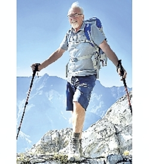

[Home](./index) &nbsp;&nbsp;&nbsp;&nbsp;[Celebration of Life](./celebration)  &nbsp;&nbsp;&nbsp;&nbsp;[Photos](./photos)  &nbsp;&nbsp;&nbsp;&nbsp;[Chris](./tributeschris)

Beverley was pre-deceased by her husband Chris. His obituary can be found at
</a href="https://edmontonjournal.remembering.ca/obituary/christopher-hoskins-1086144188">Edmonton Journal</a> and is replicated below.

HOSKINS, Christopher Francis
(MB. ChB, FRCSC) 
Born February 2, 1948 
Died September 4, 2022

On September 4 2022, a nearly cloudless day on the last long weekend of summer, Christopher Francis Hoskins set out with some family members to conquer 'Big Sister' mountain in Canmore, Alberta. The iconic peak presides over the Bow Valley; it was his favorite climb.

On the descent, while tackling a particularly difficult section, he lost his footing and fell. A spectacular effort was made by rescue services to save his life, but he unfortunately succumbed to his injuries that afternoon.

Chris was born in 1948 in Rochford, UK, but his parents moved the family to the South Island of New Zealand when he was three. From that point forward he was Kiwi, an identity that he was to hold for the rest of his life. This meant, among other things, an upbringing exploring mountains, forests, lakes and rivers - and resulted in a lifelong affection for "tramping" (Kiwi for hiking).

In 1965, he graduated from Shirley Boys High School in Christchurch, New Zealand. He went on to complete a medical degree from the University of Otago in 1972, inspired by an interest in science and a desire to work closely with people.

In 1970 Chris met his true love, Beverley. He would dote on her for the rest of his life as the true catch that she is, and she would bring a much-needed touch of order to the laughing and adventurism that united their hearts.

They moved to Edmonton, Alberta in 1975, initially intending only to stay for a four-year residency program at the University of Alberta. Instead, Chris found great satisfaction practicing as an obstetrician at the Royal Alexandra Hospital for over 40 years, where he touched the lives of thousands of families and helped deliver over 18,000 babies. He truly appreciated all his staff, colleagues and students and he was in awe of the honour to serve patients from every walk of life.

Chris was generous, funny and entirely without pretension. Besides his work, his two major passions were his family and the outdoors. He sought out adventures across the globe, but it was Canmore which became his Canadian paradise and the place where he forged so many good memories with his family and friends.

He is deeply missed by his wife Beverley; his children Verena (Jay Roberts), Andrew (Noreen O'Leary Hoskins), Ryan (Brittany Skinner) and Zoe (Kevin Light); his sister Pat Everest; his grandchildren Edward, Mackenzie, Carson, Sophie, Aoife, Paxton, Zara, Huxley, Oskar and Lochlan; many friends and relatives in New Zealand and England and many, many friends and colleagues in Canada.

In the spirit of Chris, the family asks that friends consider making donations in the form of taking a day off and going on an ambitious memorial hike. Some of the hikes he would recommend include Yamnuska, Cory Pass, Inkpots of Johnson Canyon, Taylors Mistake, Lake O'Hara, the West Coast Trail or Ha Ling. In lieu of a hike, please direct donations to the Friends of Kananaskis or to the Edmonton SPCA.

A celebration of Chris' life was held in Edmonton on October 14, 2022